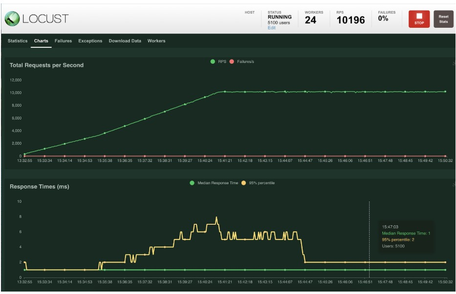

Generating MongoDB workloads using Locust
-----------------------------------------
[Locust](https://locust.io/) is an easy to use, scriptable and scalable performance testing tool written 
in Python. This allows you to easily code up the customer queries in pure Python and visualise their 
execution in a browser by plotting the number of requests per second and p50 and p95 latencies in real 
time.



Locust can run on a laptop in standalone mode. It requires almost no configuration and is easy to get 
started with. When required however, Locus can be run in a distributed mode - with a single primary that 
aggregates and exposes the stats and multiple secondaries that can drive thousands of queries per second 
against your MongoDB deployments.

This is a basic template that can be extended to build a custom workload. It contains the boilerplate code
that is needed to get started. Sample functions to insert new documents (single and bulk), run finds 
and aggregation pipelines are also implemented for reference.

To get started you should have python 3 installed. Please clone this repository, create the virtual 
environment and install the prerequisites using the following commands:
```shell
git clone https://github.com/sabyadi/mongolocust
cd mongolocust
python3 -m venv venv
source venv/bin/activate
pip install -r requirements.txt
```

Once the requirements are installed, you need to update the cluster credentials in the 
[settings.py](settings.py) to match your MongoDB deployment.

The test can be started locally in standalone mode using the following command:
```shell
(locust) adilet@MBP16 mongolocust % locust -f load_test.py
[2021-08-15 20:33:45,238] MBP16.local/INFO/locust.main: Starting web interface at http://0.0.0.0:8089 (accepting connections from all network interfaces)
[2021-08-15 20:33:45,247] MBP16.local/INFO/locust.main: Starting Locust 2.1.0
```
Finally, you can open the browser and navigate to [http://127.0.0.1:8089](http://127.0.0.1:8089) to start the test. 

Running Locust in distributed mode
----------------------------------
Locust can be run in a distributed mode, where the master instance controls the workload and 
gathers the stats from multiple client instances executing the tests and exposes a client GUI. This mode 
is required to generate higher throughput. The master and workers can be placed within the same cloud 
provider region as the Atlas cluster to minimize the network latencies.

The steps required to run the master instance:
```shell
git clone https://github.com/sabyadi/mongolocust
cd mongolocust
python3 -m venv venv
source venv/bin/activate
pip install -r requirements.txt
./run_distributed_master.sh
```

Please note the master's IP address since it will be required to access the GUI as well as to configure
workers. The workers use the same default TCP port of 8089 to establish a connection to master.

The steps required to run the workers:
```shell
git clone https://github.com/sabyadi/mongolocust
cd mongolocust
python3 -m venv venv
source venv/bin/activate
pip install -r requirements.txt
```

Then edit the MASTER_HOST variable in the  [run_distributed_worker.sh](run_distributed_worker.sh) file to 
match the master's IP address and execute the file:
```shell
./run_distributed_worker.sh
```
You can run multiple instances of the worker on every machine, since the workers are single threaded. Multiple 
machines can be used to run the workers.

Debugging the workload
----------------------
It is possible to debug locust workloads. The [main.py](main.py) contains the code required to run the 
workload generation under the python interpreter. Gevent compatibility should be enabled in your
favourite IDE debugger (feature supported both in Pycharm and VSCode) for this to work. 